# Artemis

## Table of contents
1. [Introduction & Aims](#introduction)
2. [Artemis Exercise 1](#exercise1)
3. [Artemis Exercise 2](#exercise2)
4. [Artemis Exercise 3](#exercise3)
5. [Artemis Exercise 4](#exercise4)
6. [Artemis Exercise 5](#exercise5)

## 1. Introduction 

Artemis is a DNA viewer and annotation tool, free to download and use, written by Kim Rutherford from the Sanger Institute (Rutherford et al., 2000). The program allows the user to view a range of files, from simple sequence files (e.g. fasta format) to EMBL/Genbank entries, as well as the results of sequence analyses, in a highly interactive and intuitive graphical format. Artemis is routinely used by the Pathogen Genomics group for annotation and analysis of both prokaryotic and eukaryotic genomes, and can also be used to visualize mapped data from next generation sequencing. Several types/sets of information can be viewed simultaneously within different contexts. For example, Artemis gives you the two views of the same genome region, so you can zoom in to inspect detailed DNA sequence motifs, and also zoom out to view local gene architecture (e.g. operons), or even an entire chromosome or genome, all within one screen. It is also possible to perform analyses within Artemis and save the output for future reference.

The aim of this module is to become familiar with the basic functions of Artemis using a series of worked examples. These examples are designed to take you through the most immediately useful functions. However, there will be time, and encouragement, for you to explore other menus; features of Artemis that are not described in the exercises in this manual, but which may be of particular interest to some users. Like all the Modules in this workshop, please remember: **IF YOU DON’T UNDERSTAND, PLEASE ASK!**

 [↥ **Back to top**](#top)

 ******
## Artemis Exercise 1 
 ***Starting up the Artemis software***  
 Double click the Artemis icon on the desktop.

 A small start-up window will appear (see below). The directory Module_1_Artemis contains all files you will need for this module.
 Now follow the sequence of numbers to load up the Salmonella Typhi chromosome sequence.
 Ask a demonstrator for help if you have any problems.

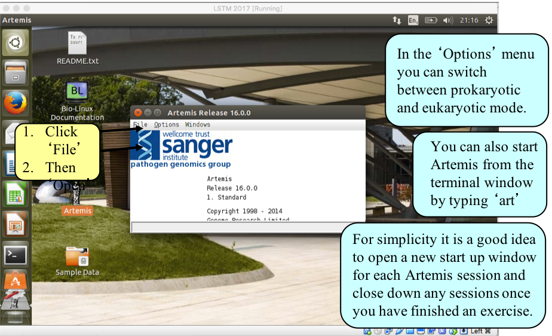

***Loading an annotation file (entry) into Artemis***  
Hopefully you will now have an Artemis window like this! If not, ask a demonstrator for assistance.

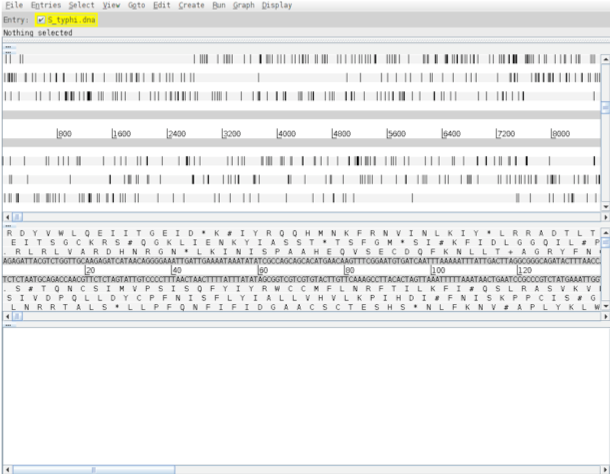

Now follow the numbers to load the annotation file for the Salmonella Typhi chromosome.

***The basics of Artemis***  
Now you have an Artemis window open let’s look at what is in there.

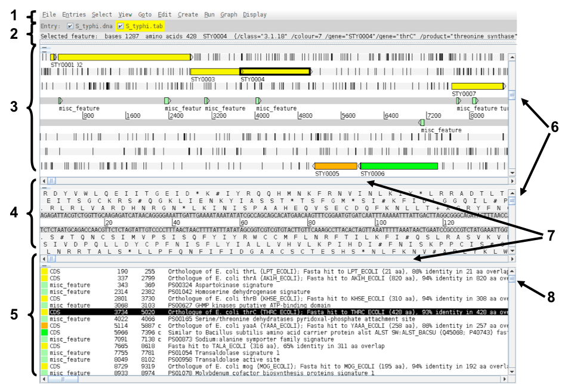

 1. Drop-down menus:
     - There’s lots in there so don’t worry about all the details right now.
 2. Entry (top line):
     - shows which entries are currently loaded with the default entry highlighted in yellow (this is the entry into which newly created features are created).Selected feature: the details of a selected feature are shown here; in this case gene STY0004 (yellow box surrounded by thick black line).
 3. Main sequence view panel:
     - The central 2 grey lines represent the forward (top) and reverse (bottom) DNA strands. Above and below those are the 3 forward and 3 reverse reading frames. Stop codons are marked on the reading frames as black vertical bars. Genes and other annotated features (eg. Pfam and Prosite matches) are displayed as coloured boxes. We often refer to predicted genes as coding sequences or CDSs.
 4. Codon translation panel:
     - This panel has a similar layout to the main panel but is zoomed in to show nucleotides and amino acids. Double click on a CDS in the main view to see the zoomed view of the start of that CDS. Note that both this and the main panel can be scrolled left and right (7, below) zoomed in and out (6, below).
 5. Feature panel:
     - This panel contains details of the various features, listed in the order that they occur on the DNA. Any selected features are highlighted. The list can be scrolled (8, below).
 6. Sliders for zooming view panels.
 7. Sliders for scrolling along the DNA.
 8. Slider for scrolling feature list.

***Getting around in Artemis***  
There are three main ways of getting to a particular DNA region in Artemis:
1. the Goto drop-down menu;
2. the Navigator; and,
3. the Feature Selector (which we will use in Exercise 4)

 The best method depends on what you’re trying to do. Knowing which one to use comes with practice.

**1. The ‘Goto’ menu**  
 The functions on this menu (below the Navigator option) are shortcuts for getting to locations within a selected feature or for jumping to the start or end of the DNA sequence. This is really intuitive so give it a try!

 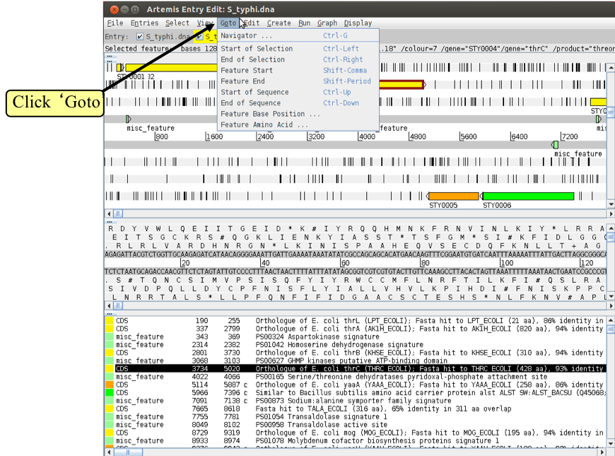

 It may seem that ‘Goto’ > ‘Start of Selection’, and ‘Goto’ > ‘Feature Start’ do the same thing. Well they do if you have a feature selected but ‘Goto’ ‘Start of Selection’ will also work for a region which you have selected by click-dragging in the main window.
 So yes, give it a try!

**Suggested tasks:**  
1. Zoom out, select / highlight a large region of sequence by clicking the left hand button and dragging the cursor then go to the start and end of this selected region.
2. Select a CDS then go to the start and end.
3. Go to the start and end of the genome sequence.
4. Select a CDS. Within it, go to a base (nucleotide) and/or amino acid of your choice.
5. Highlight a region then, from the right click menu, select ‘Zoom to Selection’.

**2. Navigator**  
The Navigator panel is fairly intuitive so open it up and give it a try.

 

**Suggestions about where to go:**  
1. Think of a number between 1 and 4809037 and go to that base (notice how the cursors on the horizontal sliders move with you).
2. Your favourite gene name (it may not be there so you could try ‘fts’).
3. Use ‘Goto Feature With This Qualifier value’ to search the contents of all qualifiers for a particular term. For example using the word ‘pseudogene’ will take you to the next feature with the word ‘pseudogene’ in any of its qualifiers. Note how repeated clicking of the ‘Goto’ button takes you to the following pseudogene in the order that they occur on the chromosome.
4. Look at Appendix VI which is a functional classification scheme used for the annotation of S. Typhi. Each CDS has a class qualifier best describing its function. Use the ‘Goto Feature With This Qualifier value’ search to look for CDSs belonging to a class of interest by searching with the appropriate class values.
5. tRNA genes. Type ‘tRNA’ in the ‘Goto Feature With This Key’.
6. Regulator-binding DNA consensus sequence (real or made up!). Note that degenerate base values can be used (Appendix X).
7. Amino acid consensus sequences (real or made up!). You can use ‘x’s. Note that it searches all six reading frames regardless of whether the amino acids are encoded or not.

- What are Keys and Qualifiers? See Appendix IV

Clearly there are many more features of Artemis which we will not have time to explain in detail. Before getting on with this next section it might be worth browsing the menus. Hopefully you will find most of them easy to understand.

[↥ **Back to top**](#top)

******
## Artemis Exercise 2   
This part of the exercise uses the files and data you already have loaded into Artemis from Part I. By a method of your choice go to the region from bases 2188349 to 2199512 on the DNA sequence. This region is bordered by the fbaB gene which codes for fructose-bisphosphate aldolase. You can use the Navigator function discussed previously to get there. The region you arrive at should look similar to that shown below.

 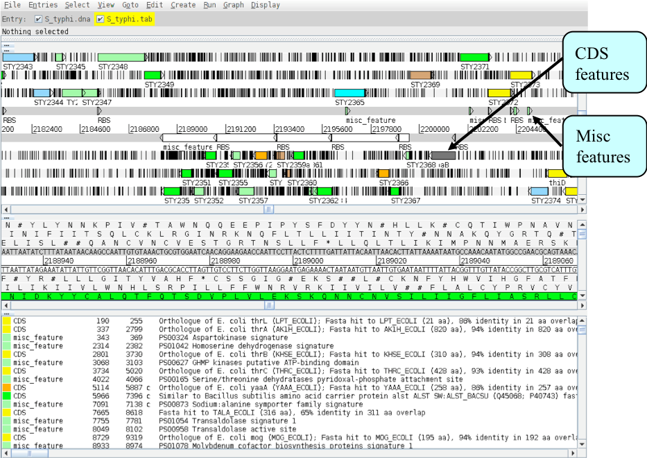

Once you have found this region have a look at some of the information available:

1. Annotation  
- If you click on a particular feature you can view the annotation associated with it: select a CDS feature (or any other feature) and click on the ‘Edit’ menu and select ‘Selected Feature in Editor’. A window will appear containing all the annotation that is associated with that CDS. The format for this information is constrained by that which can be submitted to the EMBL database.

2. Viewing amino acid or protein sequence  
- Click on the ‘View’ menu and you will see various options for viewing the bases or amino acids of the feature you have selected, in two formats i.e. EMBL or fasta. This can be very useful when using other programs that are not integrated into Artemis e.g. those available on the Web that require you to cut and paste sequence into them.

3. Plots/Graphs
- Feature plots can be displayed by selecting a CDS feature then clicking ‘View’ and ‘Feature Plots’. The window which appears shows plots predicting hydrophobicity, hydrophilicity and coiled-coil regions for the protein product of the selected CDS.

4. Load additional files
- You should be able to see the results from Prosite searches, run on the translation of each CDS, as pale-green boxes on the grey DNA lines. The results from the Pfam protein motif searches are not yet shown, but can be viewed by loading the appropriate file. Click on ‘File’ then ‘Read an Entry’ and select the file PF.tab. Each Pfam match will appear as a coloured blue feature in the main display panel on the grey DNA lines. To see the details click the feature then click ‘View’ then ‘Selection’ or click ‘Edit’ then ‘Selected Features in Editor’. Please ask if you are unsure about Prosite and Pfam.

Further information on specific Prosite or Pfam entries can be found on the web at:
http://ca.expasy.org/prosite and http://pfam.sanger.ac.uk/

In addition to looking at the fine detail of the annotated features it is also possible to look at the characteristics of the DNA covering the region displayed. This can be done by adding various plots to the display, showing different characteristics of the DNA. Some of the plots can be used to look at the protein coding potential of translation frames within the DNA, such as GC frame plot, and others can be used to search for horizontally acquired DNA.

The plot information is generated dynamically by Artemis and although this is a relatively speedy exercise for a small region of DNA, on a whole genome view (we will move onto this later) this may take a little time, so be patient.

To view the graphs:
- Click on the ‘Graph’ menu to see all those available. Perhaps some of the most useful plots are the:
     1. ‘GC Content (%)’
     2. ‘GC Deviation’
     3. ‘Karlin Signature Difference’, as shown below.
- To adjust the smoothing of the graph you change the window size over which the points on the graph are calculated, using the sliders shown below. If you are not familiar with any of these please ask.

Notice how several of the plots show a marked deviation around the region you are currently looking at. To fully appreciate how anomalous this region is move the genome view by scrolling to the left and right of this region. The apparent unusual nucleotide content of this region is indicative of laterally acquired DNA that has inserted into the genome.

Your Artemis window should now look similar to the one shown.

As well as looking at the characteristics of small regions of the genome, it is possible to zoom out and look at the characteristics of the genome as a whole. To view the entire genome you can use the sliders indicated below. However, be careful zooming out quickly with all the features being displayed, as this may temporarily lock up the computer.

To make this process faster and clearer,
1. switch off stop codons by clicking with the right mouse button in the main view panel. A menu will appear with an option to de-select ‘Stop Codons’ (see below).
2. You will also need to temporarily remove all of the annotated features from the Artemis display window. In fact if you leave them on, which you can, they would be too small to see when you zoomed out to display the entire genome.
     - To remove the annotation click on the S_typhi.tab entry button on the grey entry line of the Artemis window shown above.

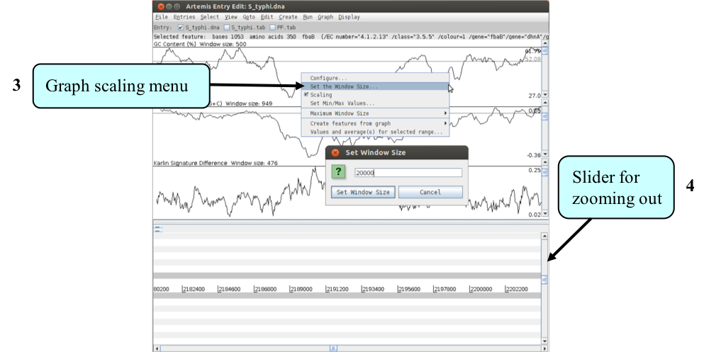

3. One final tip is to adjust the scaling for each graph displayed before zooming out. This increases the maximum window size over which a single point for each plot is calculated. To adjust the scaling click with the right mouse button over a particular graph window. A menu will appear with an option “Set the Window size’ (see above), set the window size to ‘20000’. You should do this for each graph displayed (if you get an error message press continue).
4. You are now ready to zoom out by dragging or clicking the slider indicated above. Once you have zoomed out fully to see the entire genome you will need to adjust the smoothing of the graphs using the vertical graph sliders as before, to have a similar view to that shown below.

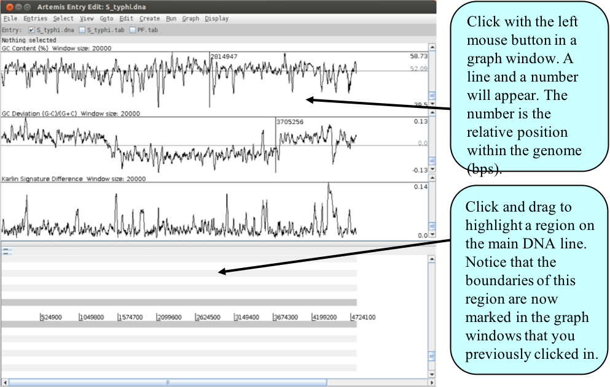

[↥ **Back to top**](#top)

******
## Artemis Exercise 3 
There are many examples where anomalous regions of DNA within a genome have been shown to carry laterally acquired DNA. In this part of the exercise we are going to look at several of these regions in more detail. Starting with the whole genome view, note down the approximate positions and characteristics of the three regions indicated above. Remember the locations of the peaks are given in the graph window if you click the left mouse button within it.

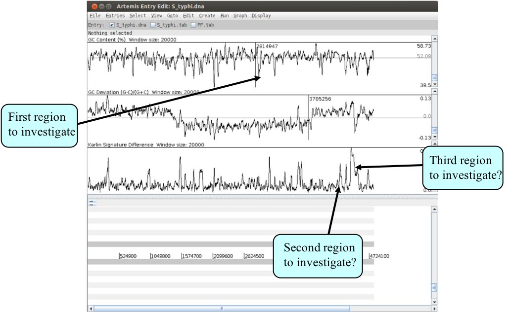

We will now zoom back into the genome to look in more detail at the first of these three peaks. Using the left mouse button, highlight the anomalous region of the graph - this will also highlight the region in the main display. You can then use the ‘right mouse button menu’ in the main display to ‘Zoom to selection’ - you may need to zoom out from there. Remember that in order to see the CDS features lying within this region you will need to turn the annotation (S_typhi.tab) entry back on.

The region you should be looking at is shown below and is a classical example of a Salmonella pathogenicity island (SPI). The definitions of what constitutes a pathogenicity island are quite diverse. However, below is a list of characteristics which are commonly seen within these regions, as described by Hacker et al., 1997.

1. Often inserted alongside stable RNAs
2. Atypical G+C contents.
3. Carry virulence-related functions
4. Often carry genes encoding transposase or integrase-like proteins
5. Unstable and self-mobilisable
6. Of limited phylogenetic distribution

Have a look in and around this region and look for some of these features.

Use one of the methods you have already used to take you to the second region of interest that you noted down.

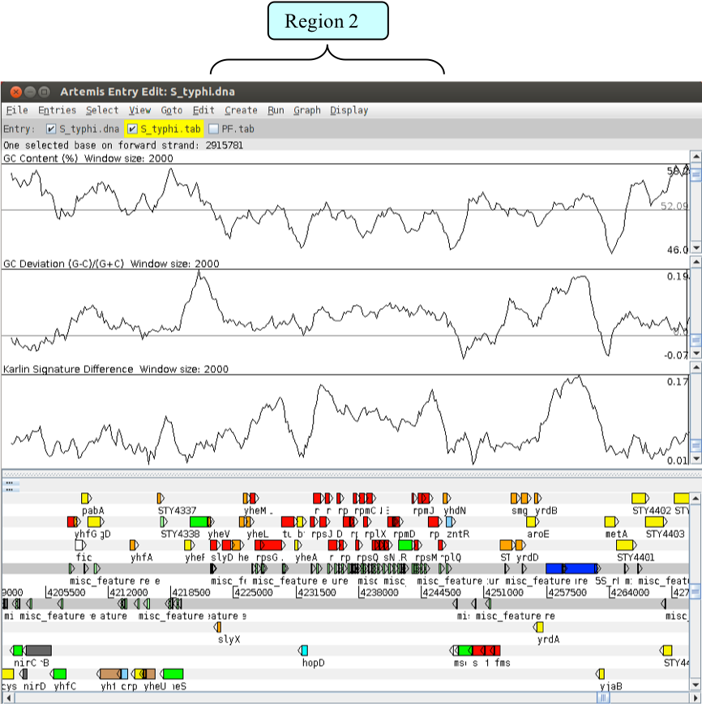

Region two acts as a cautionary note when looking at anomalous regions within a genome. Have a look at the features and annotation of the CDSs within this region:
- Does this region have any of the characteristics of pathogenicity island?
- Are the genes within this region essential or dispensable (“accessory”)?

Is it possible that the atypical base composition of this region is not a consequence of having originated from a foreign host? The base composition may actually be reflective of the tight sequence constraints under which this region has been maintained, in contrast to the background level sequence variation in the rest of the genome.

Next go to Region 3.

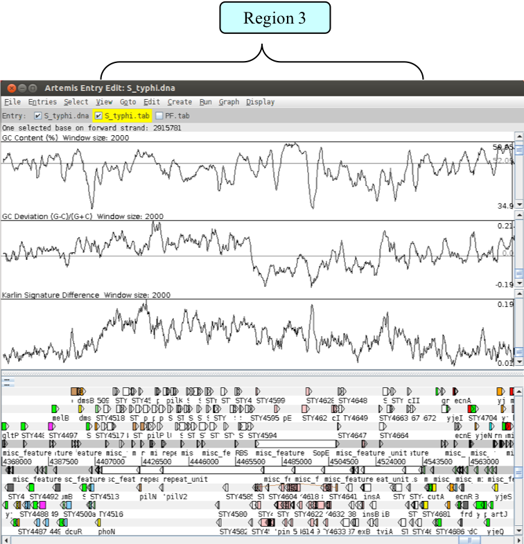

As with region 1, this region is also defined as a Salmonella pathogenicity island (SPI). SPI-7, or the major Vi pathogenicity island, is ~134 kb in length and contains ~30 kb of integrated bacteriophage. Have a look at the CDSs within this region. As before notice any stable RNAs that may have acted as the phage integration site.

[↥ **Back to top**](#top)

******
## Artemis Exercise 4 

Continuing on from the analysis of Region 3 or SPI-7 (the major Vi-antigen pathogenicity island) we are going to extract this region from the whole genome sequence and perform some more detailed analysis on it. We will aim to write and save new EMBL format files which will include just the annotations and DNA for this region.
Follow the numbers on the next page to complete the task.

A new Artemis window will appear displaying only the region that you highlighted

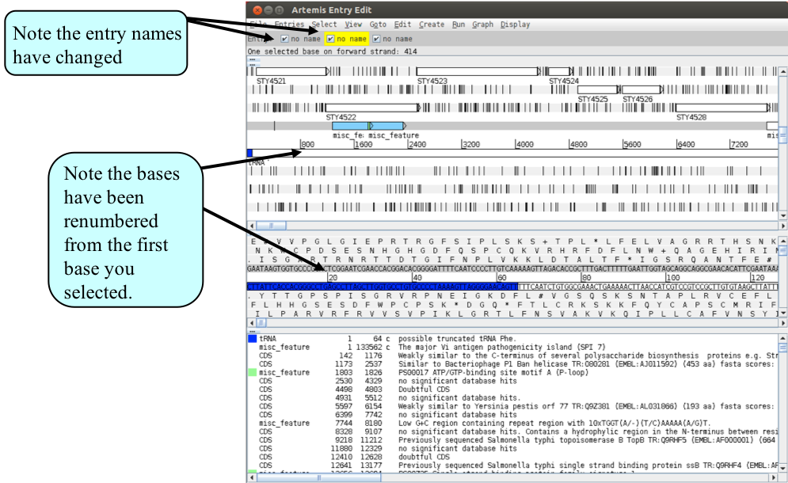

Note that the two entries on the grey ‘Entry’ line are now denoted ‘no name. They represent the same information in the same order as the original Artemis window but simply have no assigned ‘Entry’ names. As the sub-sequence is now viewed in a new Artemis session, this prevents the original files (S_typhi.dna and S_typhi.tab) from being over-written.
We will save the new files with relevant names to avoid confusion. So click on the ‘File’ menu then ‘Save An Entry As’ and then ‘New File’. Another menu will ask you to choose one of the entries listed. At this point they will both be called ‘no name’. Left click on the top entry in the list. A window will appear asking you to give this file a name. Save this file as spi7.dna
Do the same again for the second unnamed entry and save it as spi7.tab

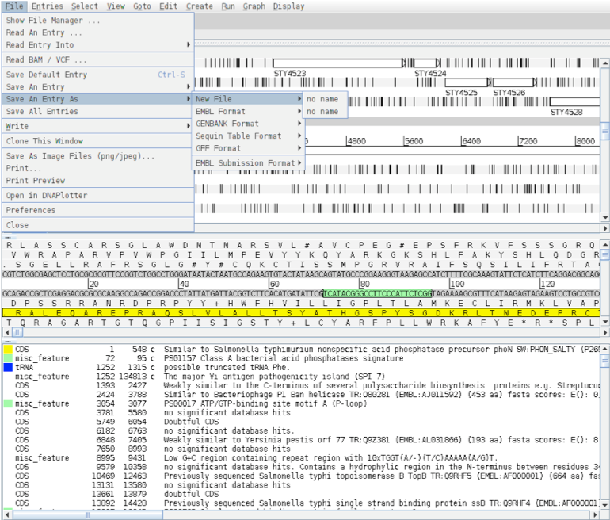

We are going to look at this region in more detail and to attempt to define the limits of the bacteriophage that lies within this region. Luckily for us all the phage-related genes within this region have been given a colour code number 12 (pink; for a list of the other numerical values that Artemis will display as colours for features see Appendix VII). We are going to use this information to select all the relevant phage genes using the Feature selector as shown below and then define the limits of the bacteriophage.

First we need to create a new entry (click ‘Create’ then ‘New Entry’). Another entry will appear on the entry line called, you guessed it, ‘no name’. We will eventually copy all our phage-related genes into here.

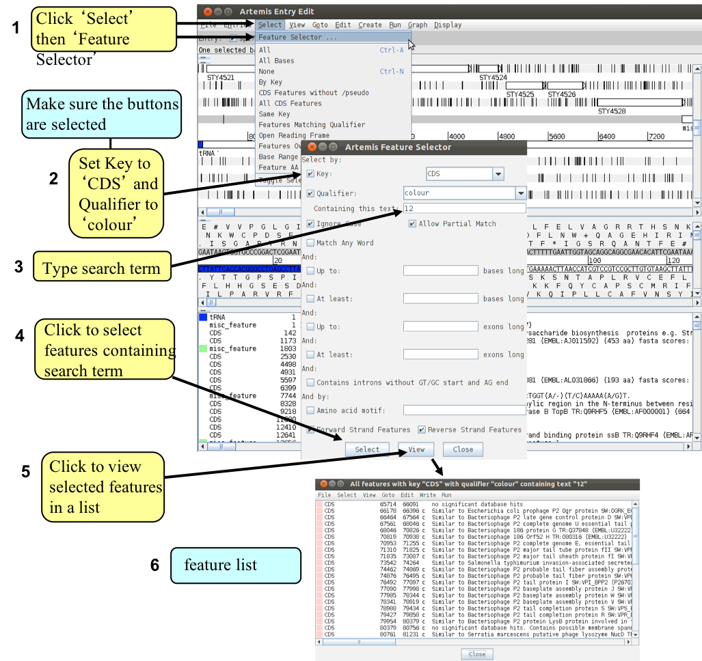

The genes listed in (6) are only those fitting your selection criteria. They can be copied or cut / moved in to a new entry so we can view them in isolation from the rest of the information within spi7.tab.

Firstly in window (6) select all of the CDSs shown by clicking on the ‘Select’ menu and then selecting ‘All’. All the features listed in window (6) should now be highlighted. To copy them to another entry (file) click ‘Edit’ then ‘Copy Selected Features To’ then ‘no name’. Close the two smaller feature selector windows and return to the SPI-7 Artemis window. You could rename the ‘no name’ entry as phage.tab, as you did before. Temporarily remove the features contained in ‘spi7.tab’ file by left clicking on the entry button on the grey entry line.  Only the phage genes should remain.

**Additional methods for selecting/extracting features using the Feature Selector**  
It is worth noting that the Feature Selector can be used in many other ways to select and extract subsets of features from the genome, using eg text or amino acid searches.

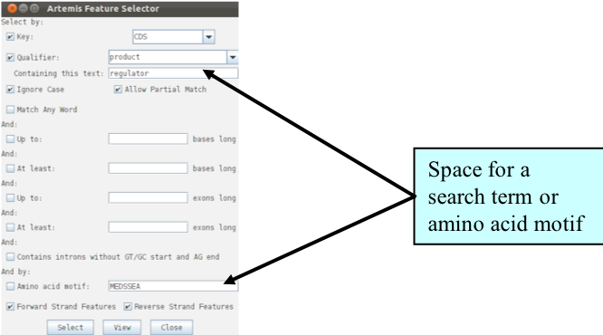

**Defining the extent of the prophage**  
Even from this preliminary analysis it is clear that the prophage occupies a fairly discrete region within SPI-7 (see below). It is often useful to create a new DNA feature to define the limits of this type of genome landmark. To do this use the left mouse button to click and drag over the region that you think defines the prophage.

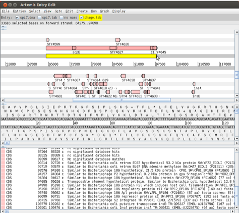

While the region in highlighted, click on the ‘Create’ menu and select ‘Create feature from base range’. A feature edit window will appear. The default ‘Key’ value given by Artemis when creating a new feature is ‘CDS’. With this ‘Key’ the newly created feature would automatically be put on the translation line. However, if we change this to ‘misc_feature’ (an option in the ‘Key’ drop down menu in the top left hand corner of the Edit window), Artemis will place this feature on the DNA line. This is perhaps more appropriate and is easier to visualise. You can also add a qualifier, such as ‘/label’: select ‘label’ from the ‘Add Qualifier’ list and click ‘Add Qualifier’, ‘/label=’ will appear in the text window; add text of your choice, then click ‘OK’. That text will be used as a feature label to be displayed in the main sequence view panel.
To see how well you have done, turn the spi7.tab.

Your final task is to write out the spi7 files in EMBL submission format, and create a merged annotation and sequence file in EMBL submission format. In Artemis you are going to copy the annotation features from the ‘.tab’ file into the ‘.dna’ file, and then save this entry in EMBL format. Don’t worry about error messages popping up. This is because not all entries are accepted by the EMBL database.

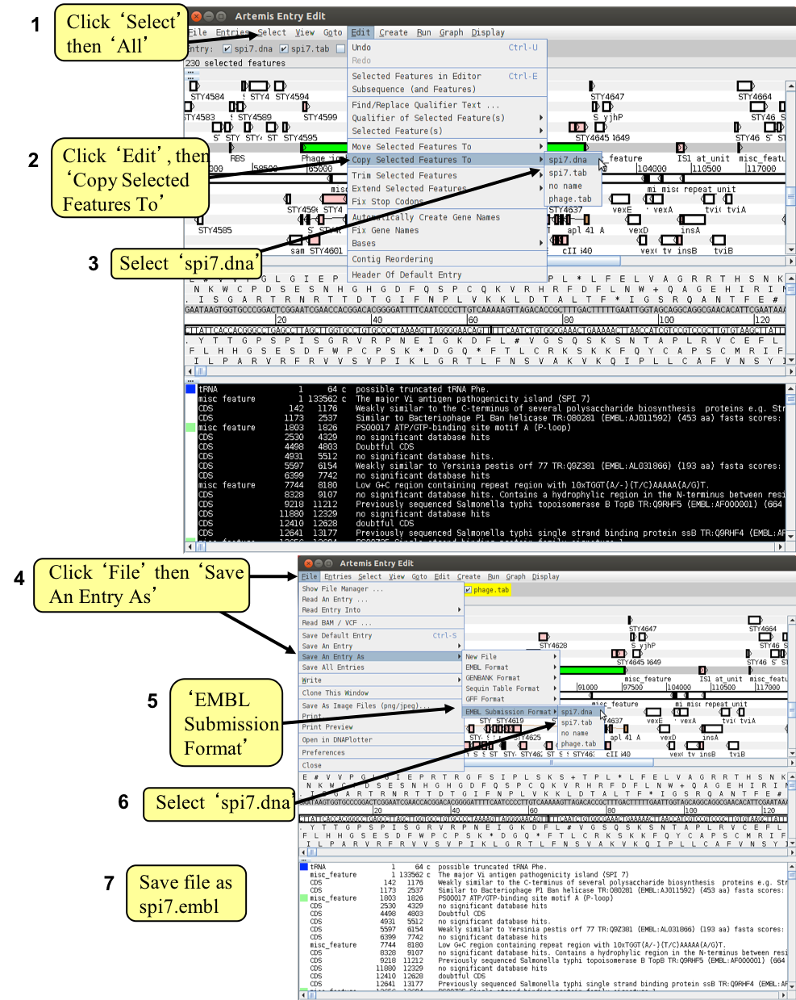

Now open the EMBL format file that you have just created in Artemis.

You will see that the colours of the features have now changed. This is because not all the qualifiers in the previous entry are accepted by the EMBL database, so some have not been saved in this format. This includes the ‘/colour’ qualifier, so Artemis displays the features with default colours.

When you download sequence files from EMBL and visualize them in Artemis you will notice that they are displayed using default colours. You can customize your own annotation files with the ‘/colour’ qualifier and chosen number (Appendix VII), to differentiate features. To do this you can use the Feature Selector to select certain features and annotate them all using the ‘Edit’, ‘Change Qualifiers of Selected’ function.

[↥ **Back to top**](#top)

******
## Artemis Exercise 5 
This exercise will introduce you to database searches and will give you a first insight in the annotation of genes.

The gene you will work on is hpcC (STY1136). Go to this gene by using one the different methods you have learned so far. You will need to close down the last Artemis exercise if you haven’t already done so. Start a new Artemis Session, as before, and open again S_typhy. dna and read the annotation file (S_typhi.tab) in.

As you can see the gene full with stop codons indicating that we are looking at a pseudogene. To correct the annotation we are going to use database search. Follow now the numbers in the figure below to start a database search. The search may take a couple of minutes to run; a banner will pop up to tell you when its complete (3).

To view the search results click ‘View’, then ‘Search Results’, then ‘fasta results’. The results will appear in a scrollable window. Scroll down to the first sequence comparison and you should see the results as shown in the next figure.

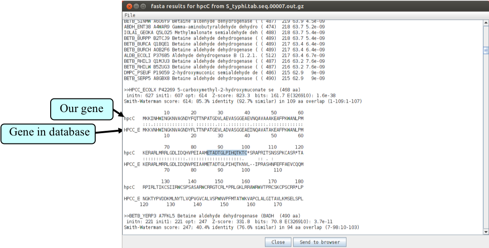

Can you see where the stop codon has been introduced into the sequence of our gene of interest? Search for the highlighted amino acid sequence in hpcC. Have a look if you can find the subsequent amino acids of the database hit in any of the three reading frames. You will see the sequence can be found in the second frame! What has happened? The last amino acid in common is a K then the amino acids start to differ till the stop codon. The amino acid K is coded by AAA. The next base is an A, too. This little homopolymeric region can cause trouble during DNA replication if the polymerase slips and introduces an additional ‘A’. This shifts the proper reading frame into the second frame.

To correct the annotation we have to edit the CDS now. Left click on the right amino acid continuing the amino acid sequence on the second frame (have a look in the fasta results and look at the sequence of the gene in the database when you are not sure) and drag till the end of the gene. Then click ‘Create’ ‘Feature from base range’ and ‘OK’. A new blue CDS feature will appear on the appropriate frame line.

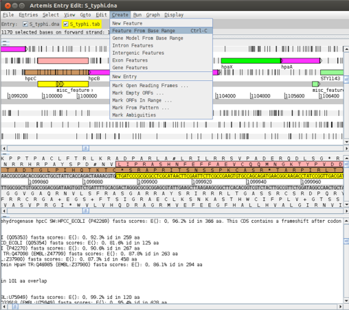

As the original gene annotation is too long we have to shorten it. Click on the original hpcC CDS, ‘Edit’ ‘Selected features in Editor’. A window will pop up and you can change the end position in ‘location’ (the end position is the last base of the stop codon).

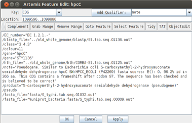

The new CDS feature can then be merged with the original gene as shown below (1-3).

A small window will appear asking you whether you are sure you want to merge these features. Another window will then ask you if you want to ‘delete old features’. If you click ‘yes’ the CDS features you have just merged will disappear leaving the single merged CDS. If you select ‘no’ all of the three CDS features (the two CDSs you started with plus the merged feature) will be retained.

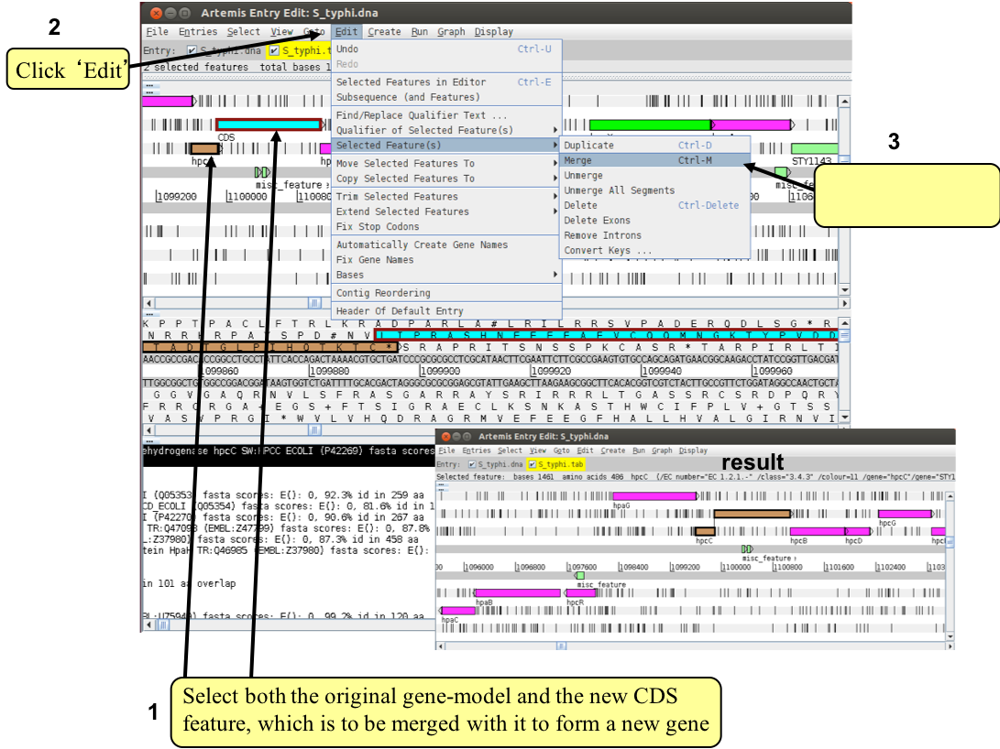

**Tip:** To select more than one feature (of any type) you must hold the shift key down.

You have now corrected the annotation of the gene. If there is some time left: Is there anything more to correct in this gene? You might need to run another blast search to find out about this.

[↥ **Back to top**](#top)

******
## License
 This work is licensed under a <a rel="license" href="http://creativecommons.org/licenses/by/4.0/">Creative Commons Attribution 4.0 International License</a>.
